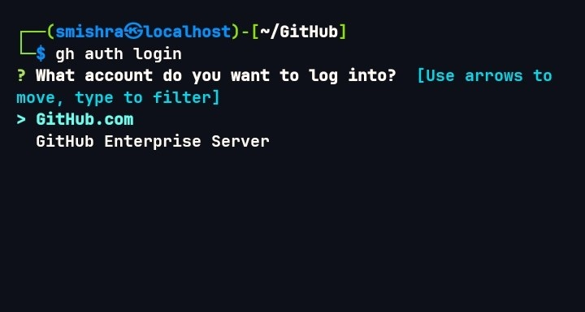
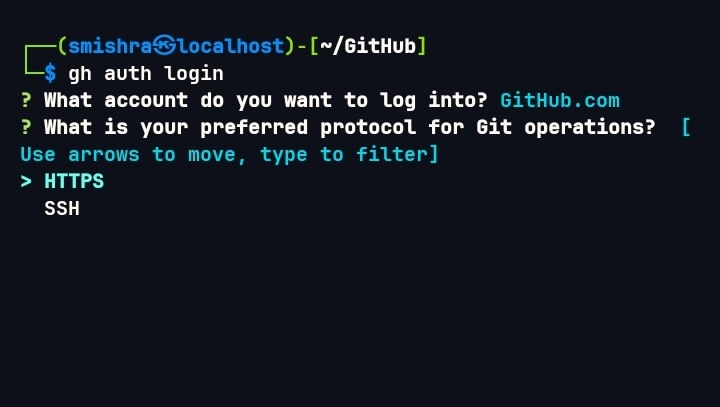
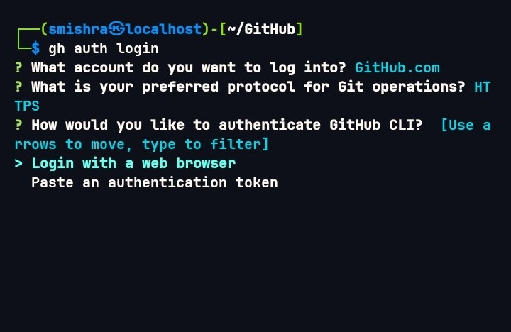
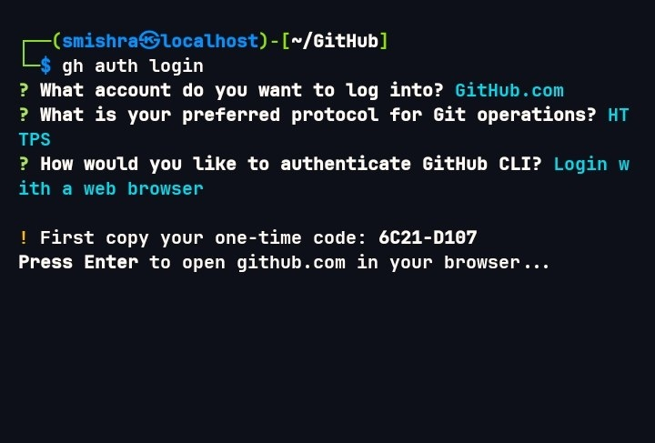
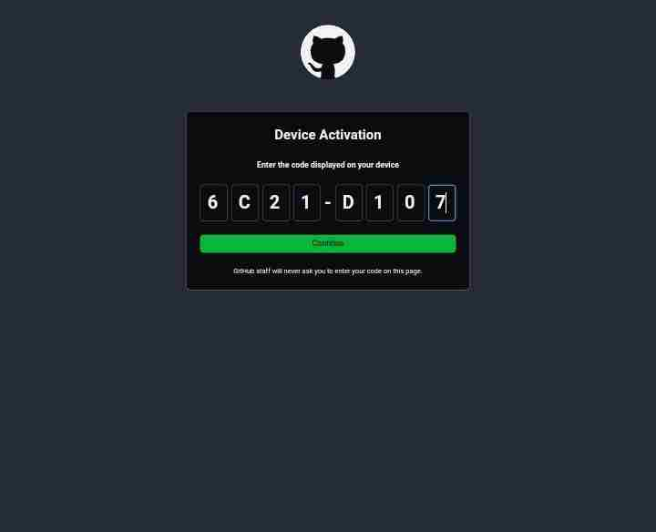
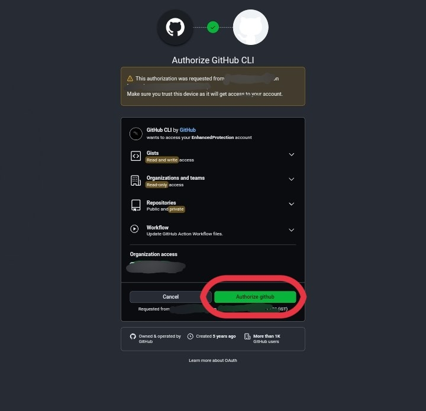

# Github CLI!
<p align="center">
                       How To Use Git CLI
</p>

#### For Termux
```bash
pkg update && pkg install openssh git gh -y
```

#### For Linux

```bash
sudo apt update && sudo apt install ssh git gh -y
```

Configure your username with this command

```bash
git config --global user.name "username"
```

Now configure your email with this command
```bash
git config --global user.email "email@emaple.com"
```

#### Note :
- The username and email must match to your github account
- The username may be case sensitive

#### Now create a directory to store ssh key
```bash
mkdir -p ~/.ssh
```

#### Create ssh key using this command
```bash
ssh-keygen -t rsa -b 2048 -C "email@example.com" -f ~/.ssh/id_rsa
```


You will be asked for some info fill them according to your choice or just press enter and enter again until it finishes.


#### Configure github account with cli

As we have created the ssh-key now its time to add that key into our github account by which we can authenticate to account by using CLI.
<br>
<br>
To do this the first steps is that we need to copy the public key of ssh for that we will be using a command

```bash
cat ~/.ssh/id_rsa.pub
```


Now copy the text (key) shown on the to the clipboard and follow the next steps 

1. Go to browser and log in to your github account
2. Click on Setting
3. Click on SSH and GPG Keys
4. Click on "New SSH key"
5. Now paste the ssh key in the "key" section
you can choose a title whatever you want and the Key type must be set to "Authentication Key"
Now click on "Add SSH key"


#### Configure gh cli that you don't can access the git'

```bash
gh auth login
```

Now it prompt to chosse account like this

choose Github.com


Now choose HTTPS

Login with a web browser

Now you will see a code on your screen and a promt to open browser
Select the browser in which you are logged in with that account

Type the code shown on the terminal and click continue

On next screen you will see something like this just click "Authorize Github"

And at last you will see a screen like this

#### Congratulation you have configured your git & gh cli!

### Now its time to upload a project to you github repo

move to your directory where you have stored your project and follow the steps

First we will initialize that directory

```bash
git init
```
Now add all the files and folders to git

```bash
git add .
```

Then we have to commit 
```bash
git commit -m "Initial commit"
```
We can configure our branch, by default it is master branch

You can check branch by typing this command

```bash
git branch
```
To rename the branch to main type

```bash
git branch -M main
```

After all this we have to add the github repo

```bash
git remote add origin https://github.com/username/repo.git
```

The final step is to push the local git to github repo
```bash
git push -u origin main
```

#### Congratulations you have uploaded your first repo with cli

Now if you have changed anything to your file and you want to update it on the repo for that we don't have to do these all thinkgs this was for the first time.
<br>

Suppose we have changed any file now follow the steps.

<br>

Fist of all the add the current file to git

```bash
git add .
```

Then we need to commit it with a reason!

```bash
git commit -m "Updated README.md"
```

The final step is to push

```bash
git push
```

#### That's it you have updated your code to github repo


